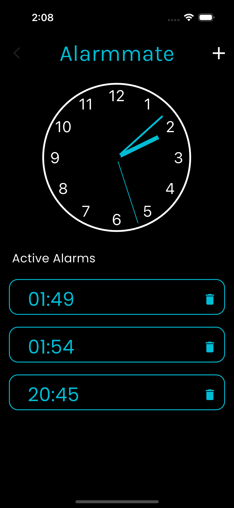
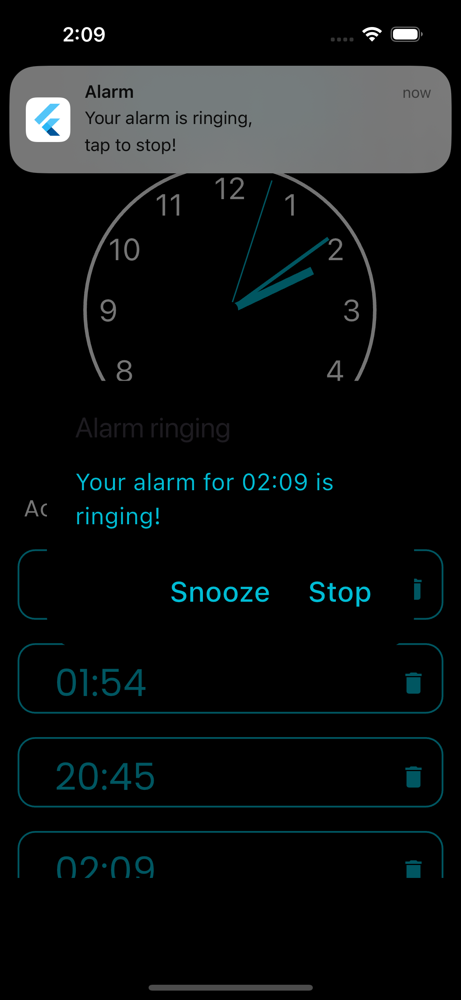

# ⏰ Alarmmate - Your Ultimate Alarm Companion

**Alarmmate** is a powerful, user-friendly Flutter alarm app designed to help you schedule and manage alarms effortlessly. With a sleek UI and reliable notifications, Alarmmate ensures you never miss a beat – whether it’s a morning wake-up call or a timely reminder!

---

## 🚀 Features

- **Simple Alarm Scheduling** - Set, edit, and manage alarms easily.
- **Customizable UI** - User-friendly design for a smooth experience.
- **Ringing Notification** - Alarmmate will notify and start ringing right on time.
- **Snooze** - Want to sleep 5 mins more? Snooze will help you with that.

---

## 📸 Screenshots

| Home Screen | Alarm Settings | Notifications |
|-------------|----------------|---------------|
|  |  |  |

---

## 🎥 Demo Video

Check out the demo of **Alarmmate** in action!

---

## 🛠️ Technologies Used
- **Flutter** - Frontend framework for cross-platform apps
- **Dart** - Primary programming language
- **alarm package** - For scheduling alarms and notifications

---

### Prerequisites
- Flutter SDK
- Android/iOS device or emulator